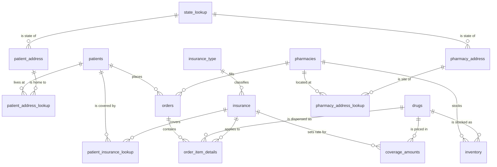

# Pharmacy Operations Relational Database Design

A normalized SQL Server database for a fictional pharmacy chain — 15 tables covering patients, prescriptions, drug inventory, and insurance coverage — plus a three-page Power BI dashboard built on top of it.

**Skills:** SQL Server · T-SQL (DDL, constraints, views) · Relational data modeling · Normalization to 3NF · Power BI · Requirements gathering

**Course:** IST 659 — Data Administration Concepts & Database Management
**Project:** "The Real Housewives of Beverly Pills" — Group 1

---

## Business Problem

A regional pharmacy chain had no single system tracking orders, patients, inventory, cost, and insurance coverage together. Staff could not answer basic operational questions: which locations were overstocked, what a patient actually owed after coverage, or which drugs moved fastest.

The database needed to:

- maintain accurate patient records, including multiple addresses and multiple insurance plans per patient
- track drug inventory per pharmacy location so stock could be kept at profitable levels
- capture per-item order cost and the insurance coverage applied to it
- support reporting on sales, order volume, and inventory without hand-built spreadsheets

Out of scope: non-drug store inventory, vendor invoicing, and employee management.

## My Role

Project Manager for a four-person team. I owned the project charter and scope definition, ran the team's work log and delivery schedule, and contributed to the conceptual and logical modeling sessions that produced the schema below. I built the Power BI relational model and front end UX experience including DAX metrics.

## Data Model

The design resolves three many-to-many relationships with bridge tables — a patient can hold several insurance plans, live at several addresses, and a drug's price varies by the insurance plan applied to it.

| Group | Tables |
|---|---|
| Patients | `patients`, `patient_address`, `patient_address_lookup` |
| Pharmacies | `pharmacies`, `pharmacy_address`, `pharmacy_address_lookup` |
| Insurance | `insurance`, `insurance_type`, `patient_insurance_lookup`, `coverage_amounts` |
| Product & stock | `drugs`, `inventory` |
| Transactions | `orders`, `order_item_details` |
| Reference | `state_lookup` |

Full attribute-level model: [`diagrams/logical-model.mmd`](diagrams/logical-model.mmd) — paste into [mermaid.live](https://mermaid.live) to view or edit.

**Constraints implemented:** primary keys on all 15 tables, composite primary keys on the three bridge tables, foreign keys across all relationships, unique constraints on `patient_ssn`, `insurance_name`, `drug_code`, and `state_name`, and check constraints preventing negative quantities, prices, and dosages.

**Reporting views** (prefixed `v_`) sit on top of the base tables so Power BI queries stay simple — `v_patient_address` and `v_pharmacy_address` flatten address fields into a single display string, and `v_order_item_details` joins coverage amounts by drug and insurance plan.

## Reporting

`powerbi/RealHousewivesOfBeverlyPills.pbix` — three pages, exported as PDF in [`docs/dashboard_export.pdf`](docs/dashboard_export.pdf):

- **Pharmacy Summary** — sales, order counts, and items ordered, sliced by pharmacy and by drug
- **Inventory** — stock levels by drug and location with low/high stock flags
- **Pharmacy Order Details** — per-patient order history, OTC vs. generic mix, and insurance coverage breakdown

## Repository Contents

| Path | Contents |
|---|---|
| [`sql/pharmacy_database.sql`](sql/pharmacy_database.sql) | Full build script — drops and recreates the database, all DDL, constraints, sample `INSERT` statements, and reporting views |
| [`data/test_data.xlsx`](data/test_data.xlsx) | Sample records used to validate the schema and populate the dashboard |
| [`powerbi/`](powerbi/) | Power BI report file (`.pbix`) |
| [`docs/`](docs/) | Project charter, dashboard PDF export, and the team work log |
| [`diagrams/`](diagrams/) | Logical data model source |

## How to Run

1. Open `sql/pharmacy_database.sql` in SQL Server Management Studio or Azure Data Studio, connected to any SQL Server instance.
2. Edit the `USE fudgemart_v3;` line near the top to name any database that exists on your instance — the script only needs to be pointed somewhere else so it can `DROP DATABASE pharmacy` cleanly before recreating it.
3. Execute the full script. It creates the `pharmacy` database, all tables and constraints, loads sample data, and creates the reporting views.
4. Open `powerbi/RealHousewivesOfBeverlyPills.pbix` in Power BI Desktop, update the data source to your SQL Server instance, and refresh.

## Team

| Name | Role |
|---|---|
| Erika Haase | Project Manager |
| Jessica Krumm | Data Governance Manager |
| Daylin Hernandez | Subject Matter Expert |
| Noor Adnan Aljiboury | Technical Advisor |

## Limitations & Next Steps

Documented honestly rather than quietly fixed, since this is the schema as submitted:

- `pharmacy_address_lookup` has a composite primary key but no foreign key constraints back to `pharmacies` or `pharmacy_address` — the patient-side bridge table has them and this one should too.
- `order_item_details.order_item_insurace_id` carries a typo in the column name.
- Two of the three check constraints on `order_item_details` both test `order_item_quantity`; the cost constraint was intended to test `order_item_cost`.
- The build script drops and recreates the database each run, which is convenient for coursework but would be replaced by migration scripts in a production setting.

## Notes

All patient, pharmacy, and insurance data in this repository is fictional and generated for coursework purposes.
